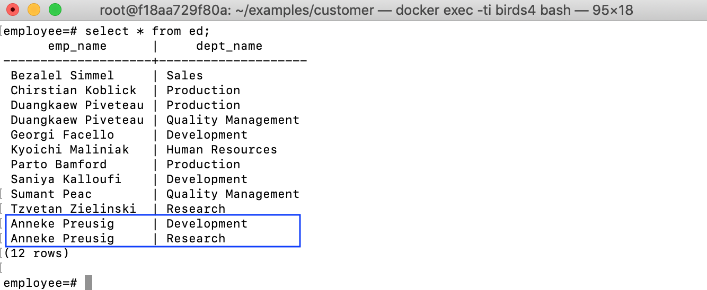
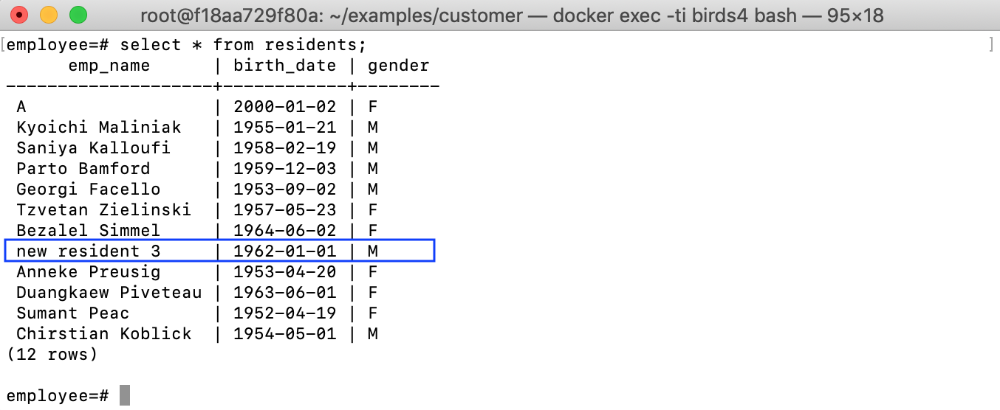

# Example: employees database schema

## Schema

The employees database ([schema.sql]({{site.github.repository_url}}/tree/master/examples/employee/db/schema.sql)) contain five base tables `male(emp_name, birth_date)`, `female(emp_name, birth_date)`, `others(emp_name, birth_date, gender)`, `ed(emp_name, dept_name)` and `eed(emp_name, dept_name)`.

Table `male` contains information about male people

emp_name           | birth_date 
-------------------|------------
 Chirstian Koblick | 1954-05-01
 Georgi Facello    | 1953-09-02
 Kyoichi Maliniak  | 1955-01-21
 Parto Bamford     | 1959-12-03
 Saniya Kalloufi   | 1958-02-19

Table `female` contains information about female people

emp_name            | birth_date 
--------------------|------------
 Anneke Preusig     | 1953-04-20
 Bezalel Simmel     | 1964-06-02
 Duangkaew Piveteau | 1963-06-01
 Sumant Peac        | 1952-04-19
 Tzvetan Zielinski  | 1957-05-23

Table `others` contains information of people having other genders

emp_name  | birth_date | gender 
----------|------------|--------
 | |

Table `ed` has all historical departments of each person

emp_name      |     dept_name      
--------------------|--------------------
 Anneke Preusig     | Development
 Bezalel Simmel     | Sales
 Chirstian Koblick  | Production
 Duangkaew Piveteau | Production
 Duangkaew Piveteau | Quality Management
 Georgi Facello     | Development
 Kyoichi Maliniak   | Human Resources
 Parto Bamford      | Production
 Saniya Kalloufi    | Development
 Sumant Peac        | Quality Management
 Tzvetan Zielinski  | Research

Table `eed` contains only former departments of each person

emp_name      |  dept_name  
--------------------|-------------
 Duangkaew Piveteau | Production
 Saniya Kalloufi    | Development

Several views are expected to be created including `residents(emp_name, birth_date, gender)`, `ced(emp_name, dept_name)`,
`residents1962(emp_name, birth_date, gender)`, `employees(emp_name, birth_date, gender)`, `researchers(emp_name)` and `retired(emp_name)`.

## Update strategy for `residents`

The view `residents` contains all personal information:

emp_name      | birth_date | gender 
--------------------|------------|--------
 Kyoichi Maliniak   | 1955-01-21 | M
 Saniya Kalloufi    | 1958-02-19 | M
 Parto Bamford      | 1959-12-03 | M
 Georgi Facello     | 1953-09-02 | M
 Tzvetan Zielinski  | 1957-05-23 | F
 Bezalel Simmel     | 1964-06-02 | F
 Anneke Preusig     | 1953-04-20 | F
 Duangkaew Piveteau | 1963-06-01 | F
 Sumant Peac        | 1952-04-19 | F
 Chirstian Koblick  | 1954-05-01 | M

For the view `residents`, we use the attribute `GENDER` to choose relevant base tables for propagating updated tuples in `residents`. More concretely, if there is
a person in `residents` but not in any of the source tables `male`,
`female` and `other`, we insert this person into the table corresponding
to his/her `GENDER`. In contrast, we delete from the source tables the
people, who do not appear in the view anymore. The Datalog putback
program for `residents` is the following ([residents.dl]({{site.github.repository_url}}/tree/master/examples/employee/residents.dl)):

```prolog
source male(EMP_NAME:string, BIRTH_DATE:string).
source female(EMP_NAME:string, BIRTH_DATE:string).
source others(EMP_NAME:string, BIRTH_DATE:string, GENDER:string).
view residents(EMP_NAME:string,BIRTH_DATE:string,GENDER:string).

+male(E, B) :- residents(E, B, G), G = 'M', not male(E, B), not others(E, B, G).
-male(E, B) :- male(E, B), G = 'M', not residents(E, B, G).

+female(E, B) :- residents(E, B, G), G = 'F', not female(E, B), not others(E, B, G).
-female(E, B) :- female(E, B), G = 'F', not residents(E, B, G).

+others(E, B, G) :- residents(E, B, G), not G = 'M', not G = 'F', not others(E, B, G).
-others(E, B, G) :- others(E, B, G), not residents(E, B, G).
```

Verifying and compiling the update strategy into SQL:


Let's try an insertion to the view `residents`:

```sql 
insert into residents values ('A', '2000-01-02', 'F');
```

The insertion will be propagated to the table `female`:


## Update strategy for `ced` 

The view `ced` contains information about the current departments of
each employee.

emp_name      |     dept_name      
--------------------|--------------------
 Chirstian Koblick  | Production
 Duangkaew Piveteau | Quality Management
 Parto Bamford      | Production
 Sumant Peac        | Quality Management
 Bezalel Simmel     | Sales
 Tzvetan Zielinski  | Research
 Kyoichi Maliniak   | Human Resources
 Anneke Preusig     | Development
 Georgi Facello     | Development

 We express the following update strategy for propagating
updated data in this view to the base tables `ed` and `eed`. If a person
is in a department according to `ed` but he/she is currently not in this
department anymore according to `ced`, this department becomes his/her
previous department, thus need to be added to `eed`. If a person used to
be in a department according to `eed`, but he/she come back to this
department according to `ced`, then this department of him/her need to be removed
from `eed`. The update strategy program is as follows ([ced.dl]({{site.github.repository_url}}/tree/master/examples/employee/ced.dl)):

```prolog
source ed(EMP_NAME:string,DEPT_NAME:string).
source eed(EMP_NAME:string,DEPT_NAME:string).
view ced(EMP_NAME:string, DEPT_NAME:string).

+ed(E, D) :- ced(E, D), NOT ed(E, D).
-eed(E, D) :- ced(E, D), eed(E, D).
+eed(E, D) :- ed(E, D), NOT ced(E, D), NOT eed(E, D).
```

Verifying and compiling the update strategy into SQL:


Let's try an update to `ced`:

```sql
update ced set dept_name = 'Research' where emp_name='Anneke Preusig';
```

Meaning that `Anneke Preusig` change her department to `Research`. This movement is reflected to the source tables:




## Update strategy for `residents1962` 

The view `residents1962` contains all residents having a birth date in 1962. 

emp_name | birth_date | gender 
----------|------------|--------
||

We define constraints to ensure that in the updated view `residents1962`
there is no tuple having a value of the attribute `BIRTH_DATE` not in
`1962`. Any view updates violating these constraints are rejected.
Interestingly, by having the updatable view `residents`, we now can use `residents` as the source table of the view `residents1962` and write an update strategy more easily.

By this way, our update strategy is to insert into the source table `residents`
any new tuples appearing in `residents1962` but not yet in `residents`.
On the other hand, we delete only tuples in `residents` having
`BIRTH_DATE` in 1962, if they do not appear in `residents1962` anymore.
The strategy is as follows ([residents1962.dl]({{site.github.repository_url}}/tree/master/examples/employee/residents1962.dl)):

```prolog
source residents(EMP_NAME:string,BIRTH_DATE:string,GENDER:string).
view residents1962(EMP_NAME:string,BIRTH_DATE:string,GENDER:string).

_|_ :- residents1962(E,B,G), B > '1962-12-31'.
_|_ :- residents1962(E,B,G), B < '1962-01-01'.

+residents(E,B,G) :- residents1962(E,B,G), ¬ residents(E,B,G).
-residents(E,B,G) :- residents(E,B,G), B >= '1962-01-01', B <= '1962-12-31', ¬ residents1962(E,B,G).
```

Verifying and compiling the update strategy into SQL:


Let's try an update to `residents1962`:

```sql
INSERT INTO public.residents1962 (emp_name, birth_date, gender) VALUES('new resident 3', '1962-01-01', 'M');
```



The generated SQL also has a fragment of code that checks whether the defined constraints on the view are satisfied when having view updates. Let's try to insert a resident not born in `1962` to the view:


The insertion is rejected with error message 'Invalid view update: constraints on the view are violated'

## Update strategy for `employees` 

The view `employees` contains residents, who are underemployment

emp_name      | birth_date | gender 
--------------------|------------|--------
 Anneke Preusig     | 1953-04-20 | F
 Bezalel Simmel     | 1964-06-02 | F
 Chirstian Koblick  | 1954-05-01 | M
 Duangkaew Piveteau | 1963-06-01 | F
 Georgi Facello     | 1953-09-02 | M
 Kyoichi Maliniak   | 1955-01-21 | M
 Parto Bamford      | 1959-12-03 | M
 Sumant Peac        | 1952-04-19 | F
 Tzvetan Zielinski  | 1957-05-23 | F

For these views, we use the two views `residents` and `ced` defined before as the
source relations. This is possible because both `residents` and `ced`
are all updatable, thus they can be treated as base tables.

More interestingly, by using constraints, we can specify more
complicated restrictions of updates on these views. As an example, we
define a constraint on the view `residents` by the following Datalog
rule: `⊥ :- employees(E,B,G), ¬ ced(E,_)`. That means there is no
tuple ⟨`E,B,G`⟩ in the updated view `employees` having the value `E` of
the attribute `EMP_NAME`, which cannot be found in any tuples of `ced`.
By the constraint, we do not allow inserting into `employees` a really
new employee, who is not mentioned in the source relation `ced`. The following is the update strategy for `employees` ([employees.dl]({{site.github.repository_url}}/tree/master/examples/employee/employees.dl)):

```prolog
source residents(EMP_NAME:string, BIRTH_DATE:string, GENDER:string).
source ced(EMP_NAME:string, DEPT_NAME:string).
view employees(EMP_NAME:string, BIRTH_DATE:string, GENDER:string).

% constraint
_|_ :- employees(E,B,G), ¬ced(E,_).

% update strategy
+residents(E,B,G) :- employees(E,B,G), ¬residents(E,B,G).
-residents(E,B,G) :- residents(E,B,G), ced(E,_), ¬employees(E,B,G).
```

Verifying and compiling the update strategy into SQL:


Let's try updating the birth date of an employee:

```sql
UPDATE employees SET birth_date='1953-04-21' WHERE emp_name='Anneke Preusig'
``` 

The source tables will be updated:


## Update strategy for `researchers`

The view `researchers` shows only employees, who are doing research.

emp_name           |
-------------------|
 Tzvetan Zielinski |

For this view, an update strategy is as the following
[researchers.dl]({{site.github.repository_url}}/tree/master/examples/employee/researchers.dl):

```prolog
source residents(EMP_NAME:string, BIRTH_DATE:string, GENDER:string).
source ced(EMP_NAME:string, DEPT_NAME:string).
view researchers(EMP_NAME:string).

-ced(E,D) :- residents(E,B,G), ced(E,D), D = 'Research', ¬researchers(E). 
+residents(E,B,G) :- researchers(E), ¬residents(E,_,_), B='0001-01-01', G='unknown'.
+ced(E,D) :- researchers(E), D = 'Research'.
```

The first two rules means if a resident is a researcher but not in the view `researchers` anymore, we deleted the current department `Research` of this resident.
By contrast, by the third rule, if a new researcher appears in the view, we need to put this department information to the table `ced`, which contains information about the current departments. 
The second rule ensures each researcher is a resident by inserting into `residents` if a researcher is not yet a resident.

Verifying and compiling the update strategy into SQL:


Let's try to remove a researcher: 

```SQL 
DELETE FROM researchers WHERE emp_name='Anneke Preusig';
```

And `Anneke Preusig` will no longer belong to the department `Research`


## Update strategy for `retired`

The view `retired` contains residents, who were retired.

|emp_name     |
|-----------------|
| Saniya Kalloufi|

The update strategy for `retired` is to remove from the `ced` the current departments of people, who are retired (in the view `retired`), and to insert a new department for each resident, who is not retired but is not yet mentioned in `ced`. We also ensure a retired person is a resident as follows ([retired.dl]({{site.github.repository_url}}/tree/master/examples/employee/retired.dl)):

```prolog
source residents(EMP_NAME:string, BIRTH_DATE:string, GENDER:string).
source ced(EMP_NAME:string, DEPT_NAME:string).
view retired(EMP_NAME:string).

-ced(E,D) :- ced(E,D), retired(E).
+residents(E,B,G) :- retired(E), ¬ residents(E,_,_), B='0001-01-01', G='unknown'.
+ced(E,D) :- residents(E,_,_), ¬retired(E), ¬ced(E,_) , D='unknown'.
```

Verifying and compiling the update strategy into SQL:


For example, if `Parto Bamford` is now retired:

```sql
insert into retired values('Parto Bamford');
```

He will not be in any department anymore:


## Update strategy for `voter`

Let `blacklist(EMP_NAME)` be a black list of residents

|emp_name     
|------------------
| Kyoichi Maliniak

We now define an update strategy for a view `voter(emp_name, birth_date)` containing residents, who have the right to vote at elections, as follows ([voter.dl]({{site.github.repository_url}}/tree/master/examples/employee/voter.dl)):

```prolog
source blacklist(EMP_NAME:string).
source residents(EMP_NAME:string, BIRTH_DATE:string, GENDER:string).
view voter(EMP_NAME:string, BIRTH_DATE:string).

⊥ :- voter(NAME,BIRTH_DATE), blacklist(NAME).

+residents(E,B,G) :- voter(E,B), G='unknown',  ¬ residents(E,B,_).
-residents(E,B,G) :- residents(E,B,G), not blacklist(E), ¬ voter(E,B).
```

The constraint `⊥ :- voter(NAME,BIRTH_DATE), blacklist(NAME).` ensures that no person in the black list can be inserted to the view `voter`. Updated data in the view `voter` is reflected to the source relation `residents` by the last two rules.

Verifying and compiling the update strategy into SQL:


If there is an attempt to insert `Kyoichi Maliniak` into `voter`:

```sql
INSERT INTO voter values('Kyoichi Maliniak', '1955-01-21');
```

The attempt will be rejected:


